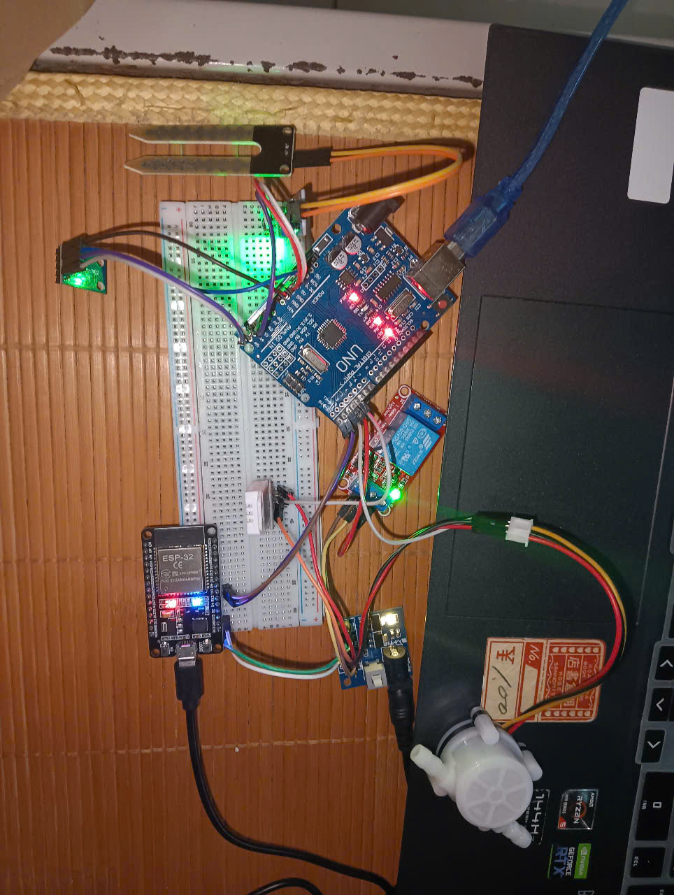

# Hệ Thống Giám Sát Thời Tiết Ảnh Hưởng Đến Năng Suất Cây Trồng 🌱

## 📌 Giới thiệu

Dự án xây dựng hệ thống giám sát các yếu tố thời tiết ảnh hưởng đến năng suất cây trồng bằng cách:
- Thu thập dữ liệu từ cảm biến môi trường: nhiệt độ, độ ẩm không khí, ánh sáng, độ ẩm đất và lưu lượng nước.
- Gửi dữ liệu từ Arduino UNO đến ESP32 qua giao tiếp UART.
- Phân tích dữ liệu bằng Python kết hợp với thư viện học máy `scikit-learn`.
- Xây dựng giao diện đơn giản bằng Tkinter để hiển thị, lưu trữ và dự đoán năng suất cây trồng.
- Đưa ra các cảnh báo và khuyến nghị chăm sóc.

---

## 🔧 Phần cứng sử dụng

| Thiết bị                  | Vai trò chính                              |
|--------------------------|--------------------------------------------|
| Arduino UNO              | Đọc dữ liệu cảm biến, điều khiển bơm        |
| ESP32                    | Giao tiếp nhận dữ liệu, xử lý và truyền đi  |
| DHT11                    | Đo nhiệt độ và độ ẩm không khí              |
| BH1750                   | Đo cường độ ánh sáng                       |
| Cảm biến độ ẩm đất       | Đo độ ẩm trong đất                        |
| Cảm biến lưu lượng nước  | Theo dõi lượng nước tưới cây              |
| Rơ-le                    | Tự động bật tắt máy bơm khi đất khô        |

---

## 💻 Phần mềm và thư viện sử dụng

- Python 3.x
- Giao tiếp Serial (`pyserial`)
- Xử lý dữ liệu (`pandas`, `numpy`)
- Học máy (`scikit-learn`)
- Giao diện (`tkinter`)

> ✅ Cài nhanh tất cả bằng lệnh:
```bash
pip install pandas numpy scikit-learn pyserial

Hình 1: Sơ đồ hệ thống kết nối cảm biến



### Hình 2: Mô hình triển khai thực tế


### Hình 3: Giao diện phần mềm Tkinter


